# コンテンツダッシュボード

AI駆動開発プレイブックのコンテンツ構造を可視化します。

---

## カテゴリ別ページ数

<canvas id="categoryChart"></canvas>

---

## コンテンツマップ

```mermaid
graph TD
    ROOT["🏠 AI駆動開発プレイブック"]

    ROOT --> COMMON["📘 共通ガイド<br/>4ページ"]
    ROOT --> IMPL["⚙️ 実装工程<br/>9ページ"]
    ROOT --> UT["🧪 単体テスト工程<br/>6ページ"]
    ROOT --> RESEARCH["🔬 リサーチ<br/>3ページ"]
    ROOT --> REVIEWS["📝 レビュー記録<br/>9ページ"]
    ROOT --> REF["📂 参考資料"]

    COMMON --> QS["クイックスタート"]
    COMMON --> MODES["Copilotモード解説"]
    COMMON --> CHK["レビューチェックリスト"]
    COMMON --> ANTI["アンチパターン集"]

    IMPL --> UC01["UC01: コード骨格生成"]
    IMPL --> UC02["UC02: 既存コード改修"]
    IMPL --> UC03["UC03: リファクタリング"]
    IMPL --> UC04["UC04: コードベース理解"]
    IMPL --> UC05["UC05: レビュー前チェック"]
    IMPL --> UC06["UC06: 修正箇所特定"]
    IMPL --> UC07["UC07: エラーログ解析"]
    IMPL --> UC08["UC08: 修正方針策定"]

    UT --> UT01["UC01: テスト自動生成"]
    UT --> UT02["UC02: テストデータ生成"]
    UT --> UT03["UC03: カバレッジ補完"]
    UT --> UT04["UC04: テストコード改善"]
    UT --> UT05["UC05: テスト仕様設計"]

    RESEARCH --> ADR["ADR: プロンプト構成設計"]
    RESEARCH --> POC["PoC ペットクリニック計画"]
    RESEARCH --> OSS["Spring Boot OSS候補"]

    REF --> AGENTS["エージェント 2件"]
    REF --> SKILLS["スキル 18件"]
    REF --> CLAUDE["Claude Code<br/>コマンド 5件"]

    SKILLS --> CD["実装系 11件"]
    SKILLS --> UTS["テスト系 5件"]
    SKILLS --> SETUP["セットアップ系 2件"]

    style ROOT fill:#1a73e8,color:#fff,stroke:none
    style COMMON fill:#34a853,color:#fff,stroke:none
    style IMPL fill:#ea4335,color:#fff,stroke:none
    style UT fill:#fbbc04,color:#333,stroke:none
    style RESEARCH fill:#9334e6,color:#fff,stroke:none
    style REVIEWS fill:#e67c73,color:#fff,stroke:none
    style REF fill:#607d8b,color:#fff,stroke:none
```

---

## スキル一覧と分類

<canvas id="skillChart"></canvas>

### スキル詳細

<table>
  <thead>
    <tr>
      <th>カテゴリ</th>
      <th>サブカテゴリ</th>
      <th>スキル名</th>
      <th>説明</th>
    </tr>
  </thead>
  <tbody>

    <tr>
      <td>{{ skill.category }}</td>
      <td>{{ skill.subcategory }}</td>
      <td><code>/{{ skill.name }}</code></td>
      <td>{{ skill.description }}</td>
    </tr>

  </tbody>
</table>

---

## レビュー履歴

  

    
2026-04-02 #01

    
初版ドラフトの全体レビュー

    

      PM: 4/5
      リーダー: 4/5
      開発者: 4/5
    

    

      「読まれる設計」「段階的導入パス（UC04から）」「人間が確認すべきこと + よくある落とし穴の二段構え」が全ロールから高評価
    

  

  

    
2026-04-03 #01

    
Copilotネイティブ設定導入後のレビュー

    

      PM: 4/5
      リーダー: 4/5
      開発者: 4/5
    

    

      全ロール維持（質的向上）。Copilotネイティブ設定への移行が完了し、実用性がさらに向上
    

  

---

## サマリー

| 指標 | 値 |
|------|-----|
| 総ページ数 | 57 |
| ドキュメントページ | 32 |
| 参考資料ページ | 25 |
| ユースケース数 | 13（実装8 + テスト5） |
| スキル数 | 18（セットアップ2 + 実装11 + テスト5） |
| エージェント数 | 2（@implementer, @tester） |
| レビューセッション | 2回 |

